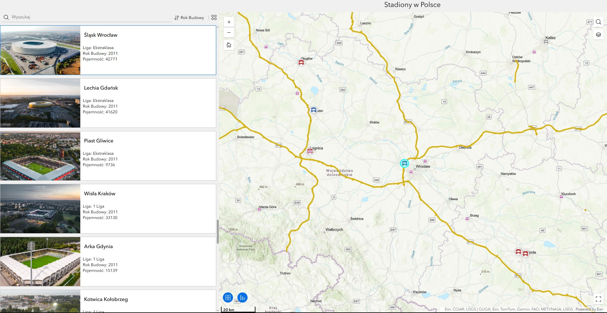
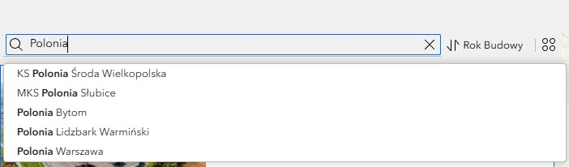
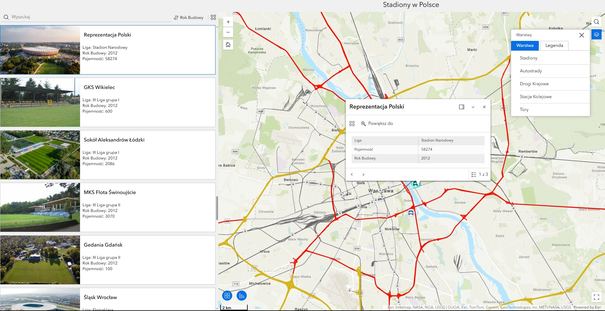

# Polish Football Stadiums – Interactive Map (2024/25 Season)

## Project Overview
This project features an interactive map of football stadiums in Poland, covering leagues from the Ekstraklasa (Top Tier) to the III Liga (4th Tier) for the 2024/25 season. Created as a university project using ArcGIS Map Builder, the application visualizes sports infrastructure in relation to the national transport network.

The primary objective was to explore the capabilities and functionality of **ArcGIS Map Builder**.

**[View the Interactive Map here](https://experience.arcgis.com/experience/bd5579aceab34dda953867e22058c377/)**

## Key Features
**Search Functionality:** Quickly find specific stadiums by club name or city.

**Interactive Sidebar:** Selecting a stadium from the list provides detailed insights:

* Club and Stadium name.

* League level for the 24/25 season.

* Year of construction.

* Total capacity.

* Stadium thumbnail image.

**Smart Navigation:** Clicking an entry automatically zooms and centers the map on the stadium's precise location.

**Infrastructure Layers:** Toggleable layers to visualize how stadiums align with the country's transport backbone.

## Data Layers
The map integrates three primary spatial components:

* **Stadiums:** Point data featuring technical parameters and locations (122 stadiums). Data was collected manually from several online sources.

* **Road Network:** National roads and motorways. Data extracted from OpenStreetMap using the included `plroads2.py` script.

* **Rail Network:** Railway lines and stations, processed via the `tory.py` script.

## Tech Stack
* **ArcGIS Map Builder** – Map engine and UI framework.
* **Python** – For spatial data engineering and filtering:
    * `OSMnx` – For retrieving OpenStreetMap data.
    * `GeoPandas` – For geospatial data manipulation.
    * `Esri Shapefile` – Format used for ArcGIS input.
